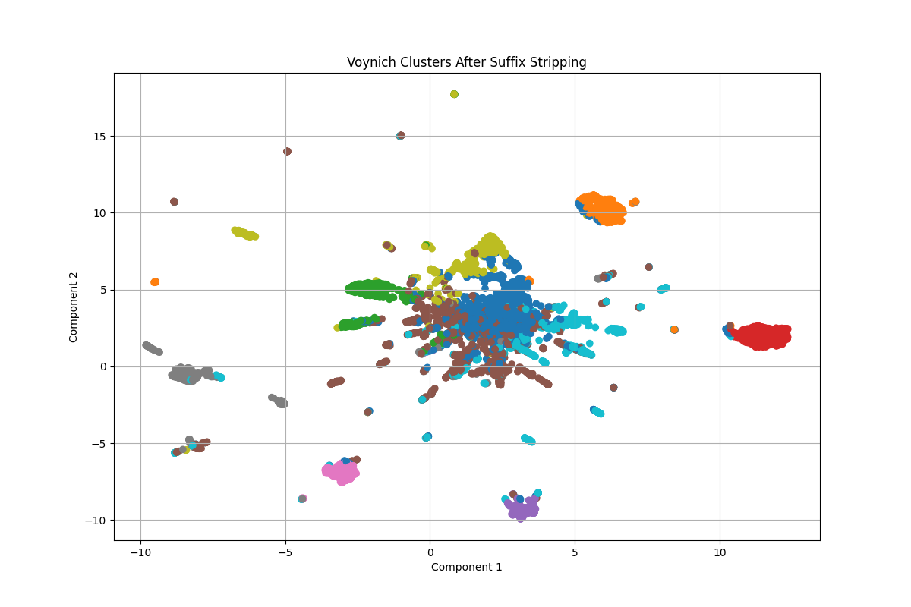
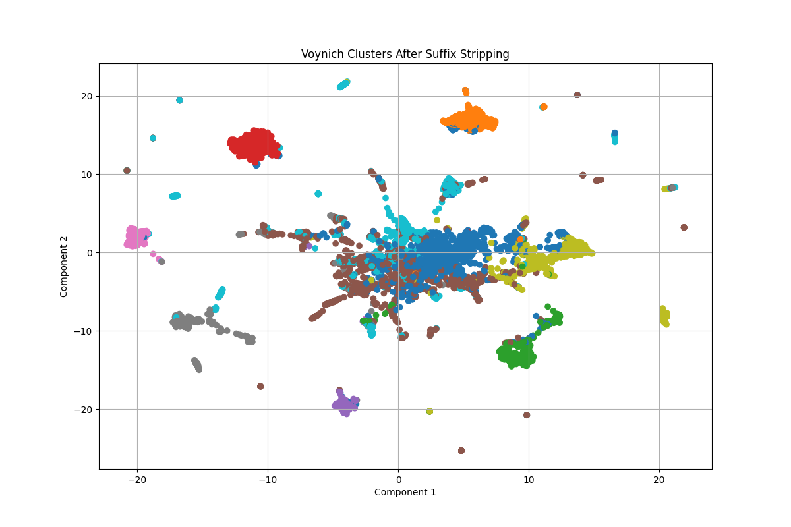

📜 Voynich Manuscript Structural Analysis
=========================================

🔍 Overview
-----------

This started as a personal challenge to figure out what modern NLP could tell us about the Voynich Manuscript — without falling into translation speculation or pattern hallucination. I'm not a linguist or cryptographer. I just wanted to see if something as strange as Voynichese would hold up under real language modeling: clustering, POS inference, Markov transitions, and section-specific patterns.

Spoiler: it kinda did.

This repo walks through everything — from suffix stripping to SBERT embeddings to building a lexicon hypothesis. No magic, no GPT guessing. Just a skeptical test of whether the manuscript has *structure that behaves like language*, even if we don’t know what it’s saying.

* * *

🧠 Why This Matters
-------------------

The Voynich Manuscript remains undeciphered, with no agreed linguistic or cryptographic solution. Traditional analyses often fall into two camps: _statistical entropy checks_ or _wild guesswork_. This project offers a middle path — using computational linguistics to assess whether the manuscript encodes real, structured language-like behavior.

* * *

📁 Project Structure
--------------------

    /data/
      AB.docx                         # Full transliteration with folio/line tags
      voynichese/                     # Root word .txt files
      stripped_cluster_lookup.json    # Cluster ID per stripped root
      unique_stripped_words.json      # All stripped root forms
      voynich_line_clusters.csv       # Cluster sequences per line
    
    /scripts/
      cluster_roots.py                # SBERT clustering + suffix stripping
      map_lines_to_clusters.py        # Maps manuscript lines to cluster IDs
      pos_model.py                    # Infers grammatical roles from cluster behavior
      transition_matrix.py            # Builds and visualizes cluster transitions
      lexicon_builder.py              # Creates a candidate lexicon by section and role
      cluster_language_similarity.py  # (Optional) Compares clusters to real-world languages
    
    /results/
      Figure_1.png                    # SBERT clusters (PCA reduced)
      transition_matrix_heatmap.png  # Markov transition matrix
      cluster_role_summary.csv
      cluster_transition_matrix.csv
      lexicon_candidates.csv
    

* * *

✅ Key Contributions
-------------------

*   Clustering of stripped root words using multilingual SBERT
*   Identification of function-word-like vs. content-word-like clusters
*   Markov-style transition modeling of cluster sequences
*   Folio-based syntactic structure mapping (Botanical, Biological, etc.)
*   Generation of a data-driven lexicon hypothesis table

* * *

🔧 Preprocessing Choices
-------------------
One of the most important assumptions I made was about how to handle the Voynich words before clustering. Specifically: I stripped a set of recurring suffix-like endings from each word — things like aiin, dy, chy, and similar variants. The goal was to isolate what looked like root forms that repeated with variation, under the assumption that these suffixes might be:

*   Phonetic padding
*   Grammatical particles
*   Chant-like or mnemonic repetition
*   Or… just noise

This definitely improved the clustering behavior — similar stems grouped more tightly, and the transition matrix showed cleaner structural patterns. But it's also a strong preprocessing decision that may have: 

*   Removed actual morphological information
*   Disguised meaningful inflectional variants
*   Introduced a bias toward function over content

So it’s not neutral — it helped, but it also shaped the results.
If someone wants to fork this repo and re-run the pipeline without suffix stripping — or treat suffixes as their own token class — I’d be genuinely interested in the comparison.

* * *

📈 Key Findings
---------------

*   **Cluster 8** exhibits high frequency, low diversity, and frequent line-starts — likely a _function word group_
*   **Cluster 3** has high diversity and flexible positioning — likely a _root content class_
*   **Transition matrix** shows strong internal structure, far from random
*   Cluster usage and POS patterns differ by _manuscript section_ (e.g., Biological vs Botanical)

* * *

🧬 Hypothesis
-------------

The manuscript encodes a structured constructed or mnemonic language using syllabic padding and positional repetition. It exhibits syntax, function/content separation, and section-aware linguistic shifts — even in the absence of direct translation.

* * *

▶️ How to Reproduce
-------------------

    # 1. Install dependencies
    pip install -r requirements.txt
    
    # 2. Run each stage of the pipeline
    python scripts/cluster_roots.py
    python scripts/map_lines_to_clusters.py
    python scripts/pos_model.py
    python scripts/transition_matrix.py
    python scripts/lexicon_builder.py
    

* * *

📊 Example Visualizations
-------------------------

#### 📌 Figure 1: SBERT cluster embeddings (PCA-reduced)

#### 📌 Figure 2: SBERT cluster embeddings (UMAP-reduced)

#### 📌 Figure 3: SBERT cluster embeddings (PaCMAP-reduced)

#### 📌 Figure 4: Transition Matrix Heatmap

* * *

📌 Limitations
--------------

*   Cluster-to-word mappings are indirect — frequency estimates may overlap
*   Suffix stripping is heuristic and may remove meaningful endings
*   No semantic translation attempted — only structural modeling

* * *

✍️ Authors Note
--------------
This project was built as a way to learn — about AI, NLP, and how far structured analysis can get you without assuming what you're looking at. I’m not here to crack the Voynich. But I do believe that modeling its structure with modern tools is a better path than either wishful translation or academic dismissal.

So if you're here for a Rosetta Stone, you're out of luck.

If you're here to model a language that may not want to be modeled — welcome.

* * *

𝌡 Recent Enhancements & Contributor Acknowledgements
------------------------
This project now includes:
*   UMAP and PaCMAP visualization support, in addition to PCA - enabling nonlinear dimensionality reduction for richer clustering insights.
*   Currently handles 3 reducers via CLI argument: no argument is PCA, --reducer umap, and --reducer pacmap.
*   Should be noted that I haven't been able to get this project to work correctly on MacOS, only Windows.
*   Updated the model from all-MiniLM-L6-v2 to paraphrase-multilingual-mpnet-base-v2 as it's larger (22M vs 110M).

**Special thanks to:**
*   @theElandor - for contributing the UMAP implemtation, CLI parsing improvements and cleanup via a pull request.
*   @patcon for contributing the PaCMAP/LocalMAP dimension reduction algorithms. I haven't gotten to LocalMAP yet but PaCMAP has really made a difference.
 
* * *

🤝 Contributions Welcome
------------------------

This project is open to extensions, critiques, and collaboration — especially from linguists, cryptographers, conlang enthusiasts, and computational language researchers.